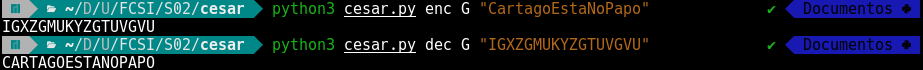
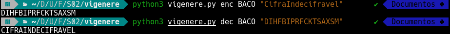
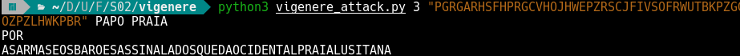
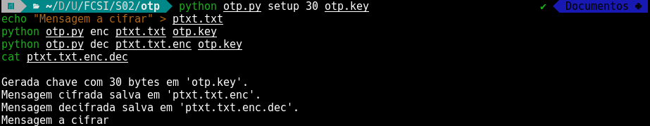
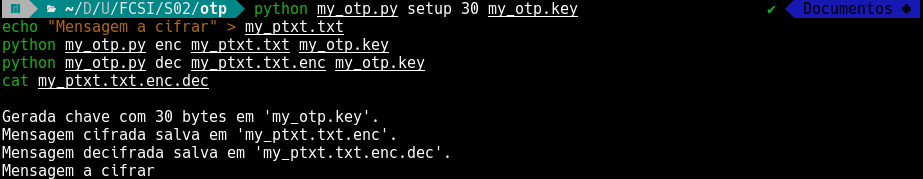
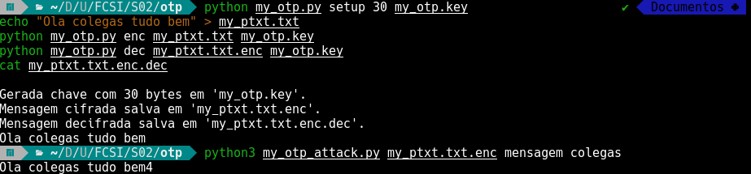

# 📝 Guião 2
## Relatório de Implementação: `cesar.py`

### 📌 Objetivo
> Escrever o programa `cesar.py`que receba 3 argumentos:
> * o tipo de operação a realizar: `enc` ou `dec`
> * a chave secreta: `A`, `B`, ..., `Z`
> * a mensagem a cifrar, por exemplo "Cartago esta no papo".
> Apresenta-se de seguida um exemplo de utilização para este programa, através do terminal:
>```bash
>$ python3 cesar.py enc G "CartagoEstaNoPapo"
>IGXZGMUKYZGTUVGVU
>$ python3 cesar.py dec G "IGXZGMUKYZGTUVGVU"
>CARTAGOESTANOPAPO
>```


### 🛠️ Estrutura Lógica do Código

O programa normaliza a entrada para maiúsculas e aplica aritmética modular ($C = (P \pm K) \mod 26$) aos índices numéricos dos caracteres (0-25). A lógica converte ASCII para índice, aplica o deslocamento fixo definido pela chave e reconverte para texto, preservando caracteres não alfabéticos.

### 📊 Resultado



---

## Relatório de Implementação: `cesar_attack.py`

### 📌 Objetivo
> Escreva o programa `cesar_attack.py` que realize um "ataque" à cifra de César. O programa deverá esperar os seguintes argumentos:
> * o cryptograma considerado;
> * uma sequência não vazia de palavras que poderão ser encontradas no texto-limpo (das palavras apresentadas, assume-se que pelo menos um ocorra no texto-limpo).
Como resultado, o programa deverá produzir:
> * resposta vazia no caso de não conseguir encontrar uma chave que faça *match* com uma das palavras fornecidas;
> * duas linhas no caso de sucesso
>   - A primeira linha com a chave usada na cifra;
>   - segunda linha com o texto limpo completo
>```bash
>$ python3 cesar_attack.py "IGXZGMUKYZGTUVGVU" BACO >TACO
>$ python3 cesar_attack.py "IGXZGMUKYZGTUVGVU" BACO >PAPO
>G
>CARTAGOESTANOPAPO
>```

### 🛠️ Estrutura Lógica do Código

Implementa um ataque de força bruta exaustiva, iterando sobre os 26 deslocamentos possíveis da cifra. Para cada chave candidata, decifra o texto e valida o resultado verificando a presença de palavras conhecidas (dicionário) fornecidas pelo utilizador.

### 📊 Resultado


---

## Relatório de Implementação: `vigenere.py`

### 📌 Objetivo
> Crie um novo programa com o nome `vigenere.py` que se comporta de forma similar ao programa anterior. A única diferença é que a chave pode agora ser uma palavra (e não um carácter). Exemplos de utilização:
>```bash
>$ python3 vigenere.py enc BACO "CifraIndecifravel"
>DIHFBIPRFCKTSAXSM
>$ python3 vigenere.py dec BACO "DIHFBIPRFCKTSAXSM"
>CIFRAINDECIFRAVEL
>```

### 🛠️ Estrutura Lógica do Código

Estende a lógica de César para uma substituição polialfabética, onde o deslocamento de cada letra é determinado pelo carácter correspondente da palavra-chave. Utiliza a operação módulo (`i % len(key)`) para repetir a chave ciclicamente, aplicando a soma modular para cifrar e a subtração para decifrar.

### 📊 Resultado



---

## Relatório de Implementação: `vigenere_attack.py`

### 📌 Objetivo
> Escreva o programa `vigenere_attack.py` que realize um "ataque" à cifra de Vigenère. O programa deverá esperar os seguintes argumentos:
> * o cryptograma considerado;
> * uma sequência não vazia de palavras que poderão ser encontradas no texto-limpo (das palavras apresentadas, assume-se que pelo menos uma ocorre no texto-limpo).
Como resultado, o programa deverá produzir:
> * resposta vazia no caso de não conseguir encontrar uma chave que faça *match* com uma das palavras fornecidas;
> * duas linhas no caso de sucesso
>   - A primeira linha com a chave usada na cifra;
>   - segunda linha com o texto limpo completo
>
>Exemplo:
>```bash
>$ python3 vigenere_attack.py 3 >"PGRGARHSFHPRGCVHOJHWEPZRSCJFIVSOFRWUTBKPZGGOZPZLHWKPBR" PAPO PRAIA
>POR
>ASARMASEOSBAROESASSINALADOSQUEDAOCIDENTALPRAIALUSITANA
>```

### 🛠️ Estrutura Lógica do Código

Realiza criptoanálise estatística (qui-quadrado) fatiando o criptograma em $N$ colunas, onde $N$ é o tamanho da chave. Trata cada fatia como uma cifra de César independente, selecionando a letra da chave que minimiza a divergência com a frequência das letras na língua portuguesa.

### 📊 Resultado



---

## Relatório de Implementação: `otp.py`

### 📌 Objetivo
>Crie o programa `otp.py` que se comporta da seguinte forma:
> * caso o primeiro argumento do program seja `setup`, o segundo argumento será o número de bytes aleatórios a gerar para chave e o terceiro o nome do ficheiro para se escrever os bytes gerados.
> * caso o primeiro argumento seja `enc`, o segundo será o nome do ficheiro com a mensagem a cifrar e o terceiro o nome do ficheiro que contém a chave a ser utilizada na operação. O resultado da cifra será guardado num ficheiro com nome do ficheiro da mensagem cifrada com sufixo `.enc`.
> * caso o primeiro argumento seja `dec`, o segundo será o nome do ficheiro a decifrar e o terceiro argumento o nome do ficheiro com a chave. O resultado será guardado num ficheiro cujo nome adiciona o sufixo `.dec` ao nome do ficheiro com o criptograma.
>
>Exemplo (assume a existência de um ficheiro `otp.key` contendo a chave):
>```
>$ python otp.py setup 30 otp.key
>$ echo "Mensagem a cifrar" > ptxt.txt
>$ python otp.py enc ptxt.txt otp.key
>$ python otp.py dec ptxt.txt.enc otp.key
>$ cat ptxt.txt.enc.dec
>Mensagem a cifrar
>``` 

### 🛠️ Estrutura Lógica do Código

Implementa a cifra *One-Time Pad* realizando uma operação bit-a-bit XOR ($\oplus$) entre os bytes da mensagem e uma chave do mesmo tamanho. A segurança é garantida pela utilização de `os.urandom()` para gerar chaves verdadeiramente aleatórias e criptograficamente seguras (CSPRNG).

### 📊 Resultado



---

## Relatório de Implementação: `my_otp.py`

### 📌 Objetivo
> Neste ponto vamos no entanto "esquecer" essa recomendação, substituindo o gerador de números aleatórios seguro pela utilização do seguinte fragmento de código:
>```python
>import random
>
>def seed_expand(x):
>    r = x
>    for _ in range(14):
>        y = x >> 8
>        x ^= y
>        r ^= x
>        x = y
>    return r
>
>def my_prng(n):
>    """ a ?SECURE? pseudo-random number generator """
>    myseed = os.urandom(16)
>    random.seed(seed_expand(int.from_bytes(myseed, byteorder='little')))
>    return random.randbytes(n)
>```

### 🛠️ Estrutura Lógica do Código

Replica a estrutura lógica do `otp.py` (cifra via XOR), mas substitui a geração de chaves segura por um gerador pseudo-aleatório (PRNG) vulnerável. A semente do gerador é derivada de uma entropia propositadamente reduzida (2 bytes/$2^{16}$), tornando o fluxo de chave determinístico e suscetível a ataques.

### 📊 Resultado



>**QUESTÃO: Q1**
>* Consegue observar diferenças no comportamento dos programas `otp.py` e `my_otp.py`? Se sim, quais?

Não existem diferenças visíveis no comportamento de execução entre os dois programas. Ambos cifram e decifram corretamente os ficheiros. 

A diferença é interna e reside na qualidade da *key*: o `otp.py` utiliza aleatoriedade do sistema operativo, enquanto o `my_otp.py` gera a *key* de forma determinística (`my_prng()`), comprometendo a segurança.

---

## Relatório de Implementação: `my_otp_attack.py`

### 📌 Objetivo

* Consegue observar diferenças no comportamento dos programas `otp.py` e `my_otp.py`? Se sim, quais?

> Pretende-se agora tirar partido da vulnerabilidade introduzida na geração menos cuidada de números aleatórios. Escreva um programa `my_otp_attack.py` que receba como primeiro argumento o nome do ficheiro com o criptograma, seguido de uma lista de palavras que poderão ser encontradas no texto limpo. Deve retornar o texto-limpo da mensagem cifrada.
>```bash
>$ python3 my_otp_attack.py ptxt.txt.enc texto cifrar
>Mensagem a cifrar
>```

### 🛠️ Estrutura Lógica do Código

Explora a vulnerabilidade da semente curta iterando por todas as 65536 possibilidades ($2^{16}$) para regenerar o fluxo de chave exato usado na cifragem. O script decifra o criptograma com cada chave gerada até encontrar uma mensagem legível que contenha as palavras de controlo esperadas.

### 📊 Resultado


O ataque apenas obteve sucesso após a redução da entropia da semente de 16 para 2 bytes. Esta alteração foi necessária para validar a premissa do enunciado de que o espaço de chaves seria limitado a $2^{16}$ possibilidades, tornando a pesquisa exaustiva exequível."



>**QUESTÃO: Q2**
>* O ataque realizado no ponto anterior não entra em contradição com o resultado que estabelece a "segurança absoluta" da cifra *one-time pad*? Justifique.

O sucesso do ataque não contradiz a segurança absoluta do *One-Time Pad*. A prova matemática de segurança do OTP exige que a chave seja verdadeiramente aleatória e do mesmo tamanho que a mensagem. O ataque funcionou porque o `my_otp.py` violou esta premissa ao usar um gerador pseudo-aleatório com espaço de sementes reduzido ($2^{16}$), degradando o sistema para uma cifra de fluxo vulnerável.